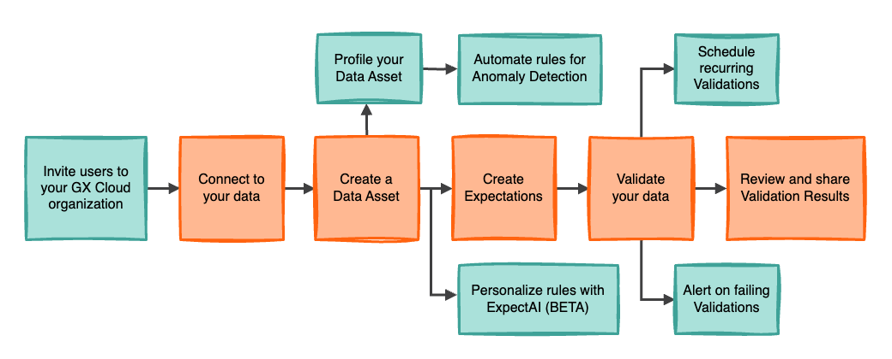

# Great Expectations (GX)


## 1. What is Great Expectations?

Great Expectations (GX) is a leading open-source Python framework for data quality. Its core mission is to help data teams eliminate pipeline debt through data testing, documentation, and profiling. Think of it as unit testing for your data.

GX is built around a simple, powerful idea: making implicit assumptions about your data explicit. It does this through three core concepts:

- **Expectations**: Declarative, human-readable assertions about your data. These are the "tests" themselves.  
  - Example: `expect_column_values_to_not_be_null(column="user_id")`  
  - Example: `expect_column_values_to_be_between(column="order_amount", min_value=0)`

- **Validations**: The process of running a suite of Expectations against a batch of your data to check if it meets your quality standards.

- **Data Docs**: Human-readable documentation and data quality reports automatically generated from your Validation Results.

As a Python library, GX integrates seamlessly into data pipelines, CI/CD workflows, and data science notebooks, providing a robust foundation for building reliable data products.

## 2. Introducing GX Cloud: The Managed Data Quality Platform

**GX Cloud** is the fully managed, enterprise-grade SaaS platform that builds upon the power of the open-source framework.

### Key Advantages:
- **Centralized Collaboration**: A single source of truth for all data quality rules and results.
- **UI-Driven Workflows**: Intuitive web interface to manage Expectations and Validations.
- **Powerful Automation**: Schedule checks, configure alerts, and detect anomalies.
- **ExpectAI**: AI-powered feature that auto-generates high-value Expectations based on your data.

## 3. The GX Cloud Workflow


A typical workflow in GX Cloud involves:

1. **Connect to Data**: Securely connect to your source (e.g., PostgreSQL, Snowflake).
2. **Create a Data Asset**: Select tables/views to monitor.
3. **Define Expectations**:
   - Manually via UI
   - Automatically with anomaly detection
   - Using **ExpectAI** for AI-recommended tests
4. **Validate Your Data**: Run checks manually, on a schedule, or via orchestrators like Airflow.
5. **Review & Share**: Analyze results in dashboards, and share links with your team.



## 4. Deployment Patterns

| Pattern        | How It Works                                                                                     | When to Use It                                                                 |
|----------------|--------------------------------------------------------------------------------------------------|--------------------------------------------------------------------------------|
| Fully-Hosted   | GX Cloud connects to your data via a secure, read-only cloud connection.                         | Quick setup; ideal for open environments.                                      |
| Agent-Enabled  | You run a GX Agent in your environment; data stays private.                                       | For strict security policies; control stays internal.                          |
| Read-Only      | You run validations locally with the open-source GX lib; only metadata is sent to GX Cloud.      | For advanced users who need full control and only want to use GX Cloud for UI. |

## 5. Connecting to Data Sources

GX Cloud offers an easy UI to connect to sources like **Databricks**, **PostgreSQL**, **Redshift**, and **Snowflake**.

### Best Practices:
- **Use a Dedicated User**: With read-only permissions.
- **Navigate to**: `Data Assets > New Data Source` in the UI.
- **Provide Connection String**: Include host, port, username, password, and DB name.
- **Create Assets**: Select tables to monitor and start testing.

## 6. Programmatic Usage with Python

Interact with GX Cloud using the `great_expectations` Python library.

### Step 1: Install the Library

```bash
pip install great_expectations
````

### Step 2: Set Environment Variables

```bash
export GX_CLOUD_ACCESS_TOKEN="<YOUR_GX_CLOUD_TOKEN>"
export GX_CLOUD_ORGANIZATION_ID="<YOUR_GX_CLOUD_ORG_ID>"
```

### Step 3: Python Script Example

```python
import great_expectations as gx
import great_expectations.expectations as gxe

# 1. Get GX Cloud context
context = gx.get_context(mode="cloud")

# 2. Load data (example: read from remote CSV using pandas source)
batch = context.data_sources.pandas_default.read_csv(
    "https://raw.githubusercontent.com/great-expectations/gx_tutorials/main/data/yellow_tripdata_sample_2019-01.csv"
)

# 3. Create Expectation Suite
suite = gx.ExpectationSuite(name="my_taxi_data_quality_suite")

# 4. Add Expectations
suite.add_expectation(gxe.ExpectColumnValuesToNotBeNull(column="pickup_datetime"))
suite.add_expectation(
    gxe.ExpectColumnValuesToBeBetween(column="passenger_count", min_value=1, max_value=6)
)

# 5. Run Validation
results = batch.validate(suite)

# 6. Review results
print(results.describe())
```

Validation results will appear in the GX Cloud UI for review and collaboration.

## 7. Operational Management: Metrics, Validations, Schedules, and Alerts

Once your Data Assets and Expectations are configured, **GX Cloud** provides a powerful set of operational tools to manage the full data quality lifecycle. These features help you move beyond defining data quality toward actively monitoring, automating, and responding to it.

### 📊 Data Profiling and Metrics

Before writing effective Expectations, understanding your data is crucial. GX Cloud includes built-in profiling tools for this purpose.

- **Automatic and On-Demand Profiling**:  
  Upon creation, each Data Asset is automatically analyzed for basic schema information. You can also trigger deeper profiling manually by clicking "Profile Data" from the **Metrics** tab.

- **Key Metrics Provided**:
  - **Row Count**: Total number of records.
  - **Data Type**: As reported by the source system (e.g., `INTEGER`, `VARCHAR`, `TIMESTAMP`).
  - **Numeric Statistics**: For numerical columns – `Min`, `Max`, `Mean`, `Median`.
  - **Completeness**: Percentage of `NULL` values per column.

These insights directly inform the creation of Expectations.  
_Example: If you see a `transaction_value` column has a minimum of `-50.00`, you might add_  
```python
expect_column_values_to_be_between(min_value=0)
````

*to flag invalid data.*

---

### ✅ Running Validations & Automating with Schedules

**Validations** are when GX runs Expectations against actual data. GX Cloud makes this easy to do manually or on a recurring schedule.

* **Manual Validations**:
  Trigger an instant check by clicking **Validate** from a Data Asset page — ideal when:

  * Creating or debugging new Expectations.
  * Investigating a recent change in the data.

* **Batch-Aware Validations**:
  For time-based datasets, validations can be scoped using `DATE` or `DATETIME` fields.

  * **Latest**: Validate only the most recent batch (e.g., yesterday).
  * **Custom**: Validate specific periods (e.g., May 2024).

* **Validation History**:

  * View past results in a **timeline graph**.
  * Filter by **failures only** for faster triage.
  * Each run has a **shareable URL** for team collaboration.

* **Automated Schedules**:

  * When your first Expectation is added, a **daily validation schedule** is enabled by default.
  * You can change:

    * **Frequency** (e.g., hourly, weekly)
    * **Start Time**
    * Or disable it altogether via a toggle.

  ⚠️ *Note: These built-in schedules are only for **UI-managed** Expectations. For **API-managed** Expectations, use external orchestrators like Airflow.*

---

### 🚨 Proactive Alerts & Notifications

GX Cloud ensures you’re notified of critical quality events — before they impact your downstream systems.

* **Alert Triggers**:

  * When a **validation fails**.
  * When **ExpectAI** completes an analysis and recommends new Expectations.

* **Personalized Configuration**:

  * Alerts are set **per-user and per-asset**.
  * You receive alerts only for the data you are responsible for.

* **Smart Defaults**:

  * Alerts are **enabled by default** for Data Assets you create.
  * Alerts are **disabled by default** for assets created by others.

Manage all alert preferences from the **Alerts** tab of any Data Asset using simple toggle switches.


