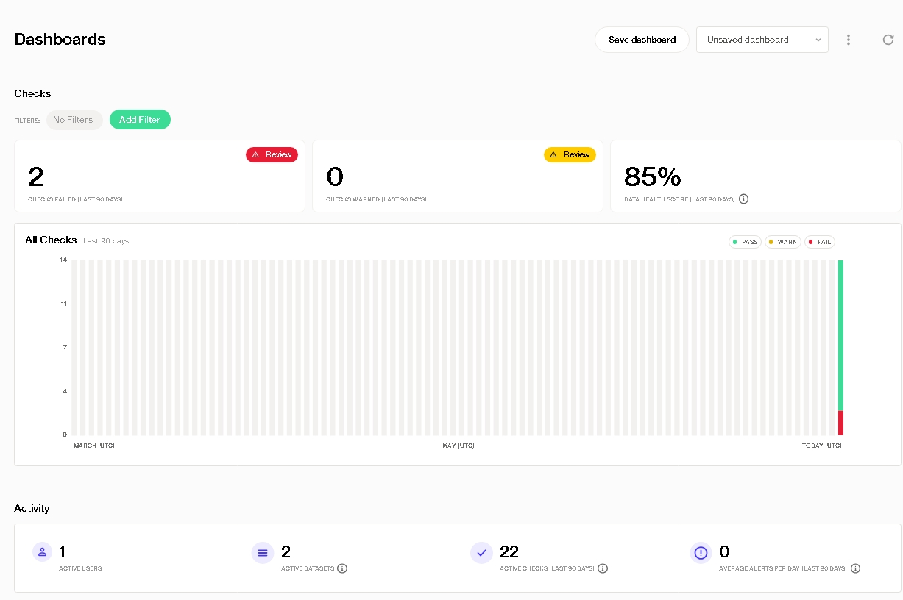
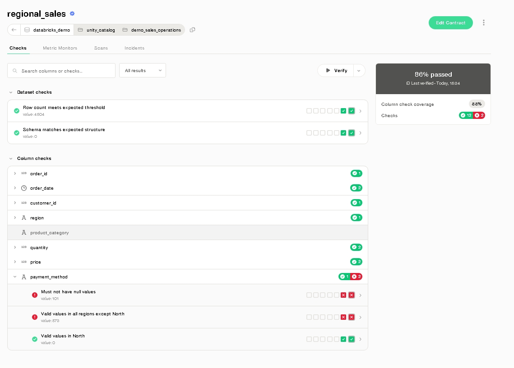
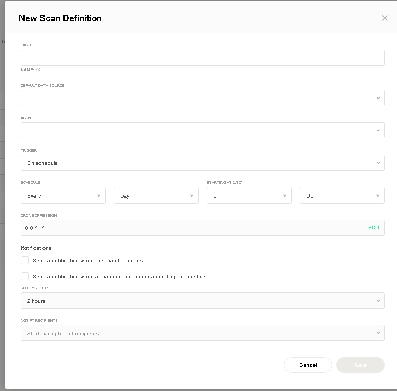

# Soda: The End-to-End Platform for Data Quality

A comprehensive platform for ensuring reliable, trustworthy, and high-quality data across your entire data stack.

---

## What is Soda?

In today's data-driven world, poor data quality leads to flawed business decisions, erodes trust, and creates costly engineering rework. Soda is an open-source, data reliability platform that enables data teams to proactively find, analyze, and resolve data issues before they have a downstream impact.

It provides a unified, declarative language (**SodaCL**) to define what good data looks like, directly within your engineering workflows. Soda then runs tests against your data, monitors for anomalies, and provides a central command center (**Soda Cloud**) for collaboration and incident management.

## Core Capabilities

Soda empowers data teams with a suite of powerful capabilities to manage the entire data quality lifecycle:

*   ✅ **Comprehensive Testing & Validation**: Use the intuitive Soda Checks Language (SodaCL) to define a vast array of tests—from simple null checks and freshness validations to complex SQL-based business logic.

*   🤖 **Automated Monitoring & Anomaly Detection**: Schedule scans to run within your data pipelines (Airflow, Dagster, etc.) or on a regular basis. Leverage machine learning to automatically detect anomalies and unexpected changes in your data patterns.

*   🤝 **Centralized Collaboration & Incident Management**: Soda Cloud acts as your central command center. It visualizes data health over time, creates actionable 'Incidents' from failed checks, and notifies the right people on the right channels (Slack, Teams, Jira).

*   📝 **Proactive Data Contracts**: Shift left and prevent bad data at the source. Implement machine-readable Data Contracts to enforce schema and quality guarantees between data producers and consumers, directly within your CI/CD pipeline.

## Who is Soda For?

Soda is built for modern data teams—including **Data Engineers, Analytics Engineers, Data Scientists, and Data Analysts**—who are committed to delivering reliable data products.

## How Soda Works: The Core Components

Soda's power comes from its modular architecture, which separates the definition of quality, the execution of tests, and the management of results. This process revolves around a few key components:

### 1. SodaCL: The Language of Data Quality
At the heart of Soda is **SodaCL** (Soda Checks Language), a human-readable, domain-specific language (DSL) written in YAML. It provides a simple yet powerful way for both technical and non-technical users to define what good data looks like.

Instead of writing complex SQL queries, you declare your expectations:

```yaml
# In a file named checks.yml
checks for orders:
  - row_count > 0:
      name: Dataset is not empty
  - missing_count(customer_id) = 0:
      name: All orders must have a customer
  - duplicate_count(order_id) = 0:
      name: Order IDs must be unique
````

### 2. The Soda Scan: Executing Checks

A scan is the central action in Soda. When a scan is initiated, Soda's engine performs a critical function:

1. It reads your `checks.yml` file.
2. It translates your SodaCL checks into optimized SQL queries that are native to your data source (e.g., Snowflake, BigQuery, PostgreSQL).
3. It executes these queries directly within your data source.

This "push-down" approach is fundamental to Soda's security and performance model. Your data never leaves your environment—Soda only retrieves the aggregated results of the checks (e.g., a row count, a number of missing values), not the underlying data itself.

### 3. Soda Cloud: The Command Center

While scans can be run from the command line, Soda Cloud is the centralized platform for observability, collaboration, and incident management. It is where you:

* 📊 **Visualize Results**: See the health of your datasets over time through interactive dashboards.
* 🔔 **Manage Incidents**: Automatically create, assign, and track data quality issues from failed checks.
* ⚙️ **Configure Alerts**: Set up rules to notify your team via Slack, MS Teams, or Jira when a data quality issue is detected.
* 🗓️ **Schedule Scans**: Automate your data quality monitoring to run on a schedule without manual intervention.
* 👥 **Collaborate**: Discuss data issues with your team directly within the context of the data.

### 4. Deployment Models: Soda Library & Soda Agent

Soda's execution engine can be deployed in a way that best fits your infrastructure:

* **Soda Library**: The core Python library and Command-Line Interface (CLI). Ideal for self-operated deployments—run scans from your local machine, a CI/CD runner, or a data orchestrator like Airflow.
* **Soda Agent**: A secure, containerized version of the Soda Library. Acts as a bridge, allowing Soda Cloud to initiate scans within your private network without exposing database credentials. This underpins both Soda-hosted and self-hosted deployments, enabling a user-friendly, UI-driven experience.


## Getting Started: Your First Data Quality Scan

The fastest way to experience Soda is to run a scan on your local machine using our "Take a Sip" tutorial. This 15-minute guide will walk you through setting up Soda, running it against a sample dataset, and seeing the results.

### Prerequisites

Before you begin, ensure you have the following installed on your system:

* **Python** (version 3.8, 3.9, or 3.10)  
* **Pip** (version 21.0 or greater)  
* **(Optional) Docker Desktop**: To easily spin up a sample PostgreSQL database.

### 1. Set Up Your Project

First, create a project directory and a Python virtual environment. This is a best practice to keep your project dependencies isolated.

```bash
# Create and navigate to your project directory
mkdir soda_project
cd soda_project

# Create a virtual environment
python3 -m venv .venv

# Activate the virtual environment
# On macOS and Linux:
source .venv/bin/activate
# On Windows:
# .venv\Scripts\activate
````

### 2. Install Soda

Install the Soda Library package for PostgreSQL. This tutorial uses a PostgreSQL sample dataset, but Soda supports over 20 different data sources.

```bash
# Install Soda Library for PostgreSQL
pip install soda-postgres
```

### 3. Configure Your Data Connection

Create a `configuration.yml` file. This file tells Soda how to connect to your data source. For this tutorial, we will use Docker to run a sample PostgreSQL database.

```bash
# Run the sample database in Docker
docker run \
  --name sip-of-soda \
  -p 5432:5432 \
  -e POSTGRES_PASSWORD=soda \
  sodadata/soda-adventureworks
```

Now, create the `configuration.yml` file with the following content:

```yaml
# In a new file named configuration.yml
data_source adventureworks:
  type: postgres
  host: localhost
  port: 5432
  username: postgres
  password: soda
  database: postgres
  schema: public
```

### 4. Write Your Data Quality Checks

Create a `checks.yml` file. This is where you define your data quality rules using SodaCL.

```yaml
# In a new file named checks.yml
checks for dim_customer:
  - row_count > 0:
      name: Dataset is not empty
  - missing_count(last_name) = 0:
      name: Last names must be populated
  - duplicate_count(phone) = 0:
      name: Phone numbers must be unique
```

### 5. Run the Scan

You are now ready to run your first Soda scan! Execute the following command in your terminal:

```bash
soda scan -d adventureworks -c configuration.yml checks.yml
```

### 6. Analyze the Results

The output in your terminal will show a summary of the scan, indicating which checks passed and which failed:

```text
Scan summary:
2/3 checks PASSED:
  dim_customer in adventureworks
    Dataset is not empty [PASSED]
    Last names must be populated [PASSED]
1/3 checks FAILED:
  dim_customer in adventureworks
    Phone numbers must be unique [FAILED]
      check_value: 715

Oops! 1 failure. 0 warnings. 0 errors. 2 pass.
```

## From Reactive to Proactive: Preventing Bad Data with Data Contracts

While running scans to *validate* data is powerful, the most effective data quality strategy is to *prevent* bad data from being created in the first place. This is the goal of a **Data Contract**.

A Data Contract is a formal, machine-readable agreement between a **data producer** (such as a microservice or an application) and its **data consumers** (such as an analytics team). It defines the expected structure (schema) and quality standards for a dataset, ensuring that any data published adheres to these rules.

Think of it as a quality guarantee, enforced automatically.

### How Data Contracts Work in Soda

The Data Contract process is designed to integrate seamlessly into your software development lifecycle (CI/CD):

1.  **Define the Contract**: The data producer defines the contract in a `data_contract.yml` file, which lives alongside the application code in a Git repository. This file specifies both the **schema** and the **quality checks**.

    ```yaml
    # A sample data_contract.yml
    dataset: orders

    # 1. Schema Agreement: What the data should look like.
    schema:
      - name: order_id
        data_type: text
        required: true
      - name: order_total
        data_type: decimal
        required: true
      - name: customer_id
        data_type: text
        required: true

    # 2. Quality Agreement: The standards the data must meet.
    checks:
      - missing_count(customer_id) = 0
      - for each:
          # Ensure order totals are always positive for every customer.
          check: |
            order_total >= 0
    ```

2.  **Enforce the Contract**: When a developer makes a change that affects the data, the CI/CD pipeline automatically triggers the `soda verify` command.

3.  **Verify and Validate**: The `soda verify` command performs two critical actions:
    *   **Schema Verification**: It compares the *actual* schema of the data produced by the code change against the schema defined in the contract.
    *   **Quality Validation**: It runs the quality checks from the contract against the data.

4.  **Provide a Verdict**:
    *   **If both schema and quality checks pass ✅**, the CI/CD pipeline proceeds, and the changes can be merged.
    *   **If there is any violation ❌**, `soda verify` fails, which in turn **fails the CI/CD pipeline**. This blocks the merge and prevents the bad data from ever reaching production.

This "shift-left" approach ensures that data quality is a responsibility of the producer, not an afterthought for the consumer. It builds a foundation of trust and reliability directly into the development process.


## Practical Demo: Verifying a Data Contract Programmatically

To see a Data Contract in action, you can explore  hands‑on demonstration in a Google Colab notebook. This notebook simulates a CI/CD process where a contract is verified against a live data source before the "code" is approved.

[](https://colab.research.google.com/drive/1zkV_2tLJ4ohdzmKGS3LgdFDDnTNTUXew)

### Breakdown of the Notebook

The notebook walks through the exact steps an automated system would take to enforce a Data Contract.

#### 1. Setup and Installation

```python
# Installs the core Soda engine into the environment.
!pip install -U soda-core
````

This first step prepares the execution environment by installing the necessary Soda library.

#### 2. Securely Configuring Soda Cloud

```python
import os

# Creates a configuration file with your Soda Cloud API keys.
# This allows the script to communicate with your Soda Cloud account.
soda_cloud_config = f"""
soda_cloud:
  host: beta.soda.io
  api_key_id: {os.getenv("API_KEY_ID")}
  api_key_secret: {os.getenv("API_KEY_SECRET")}
"""
with open("soda-cloud.yml", "w") as f:
    f.write(soda_cloud_config)
```

This block securely creates the `soda-cloud.yml` file, which authenticates the script and authorizes it to fetch contracts and publish results on your behalf.

#### 3. Executing the Verification

This is the core of the demonstration, where a single function call kicks off the entire process.

```python
from soda_core.contracts import verify_contracts_on_agent

# Initiate the contract verification process
res = verify_contracts_on_agent(
    # Specify which dataset's contract to verify
    dataset_identifiers=["databricks_demo/.../regional_sales"],

    # Use the configuration file created earlier
    soda_cloud_file_path="soda-cloud.yml",

    # Ensure results are published back to Soda Cloud
    publish=True
)

# Print the results of the verification
print(res.get_logs())
```

The `verify_contracts_on_agent` function performs the following automated workflow:

1. **Fetches the Contract**: Connects to Soda Cloud and retrieves the pre‑defined Data Contract for the `regional_sales` dataset.
2. **Delegates the Scan**: Sends the contract and connection details to the appropriate Soda Agent, which is co‑located with the data.
3. **Runs the Verification**: The Agent executes the scan, comparing the live data against the schema and quality checks defined in the contract.
4. **Returns the Verdict**: Returns a result object containing a detailed log and a pass/fail verdict.

#### 4. Analyzing the Output

The final output is a clear, actionable summary of the contract verification. The notebook's example output shows the failed checks:

```text
+-----------------+------------------------------------------+-----------+------------------------+
| Column          | Check                                    | Outcome   | Details                |
+=================+==========================================+===========+========================+
| payment_method  | Must not have null values                | ❌ FAILED | missing_count: 139     |
|                 |                                          |           | row_count: 2701        |
|                 |                                          |           | missing_percent: 5.14  |
+-----------------+------------------------------------------+-----------+------------------------+
|                 | Valid values in all regions except North | ❌ FAILED | invalid_count: 342     |
|                 |                                          |           | row_count: 2701        |
|                 |                                          |           | invalid_percent: 12.66 |
+-----------------+------------------------------------------+-----------+------------------------+
```

This result provides immediate, specific feedback to the data producer. In a real‑world CI/CD pipeline, any **FAILED** outcome would stop the deployment, forcing the developer to fix the issues before their changes can be approved.

This programmatic enforcement is what makes Data Contracts a powerful tool for building a culture of data reliability.

## The Command Center: Exploring the Soda Cloud UI

While Soda's power lies in its flexible, code-based foundation (SodaCL and the Soda Library), its intelligence, collaboration, and governance capabilities come to life in **Soda Cloud**—the web interface that acts as the command center for your entire data quality operation.

Soda Cloud transforms raw check results into actionable intelligence and fosters a culture of data reliability across the organization. It's where engineers, analysts, and data owners meet to ensure data is trustworthy.

### Key Benefits & Features of Soda Cloud

#### 1. Centralized Data Quality Observability
Soda Cloud provides a "single pane of glass" to monitor the health of all your data assets. From high-level dashboards to granular, check-level details, you can instantly assess the state of your data.

*   **At-a-glance Dashboards:** Get an immediate overview of your data health score, see how many checks have failed recently, and track quality trends over time.

    

*   **Drill-Down Analysis:** Navigate from a high-level dashboard directly to a specific dataset to see a detailed breakdown of all its checks. You can see which checks are passing or failing at the column level, along with their latest results.

    

*   **Advanced Filtering:** Use the global "Checks" page to search, sort, and filter every data quality check across all your data sources, giving you complete control and visibility.

#### 2. Proactive Incident Management
Soda Cloud turns a failed check from a simple log entry into a structured, manageable workflow.

*   **Automated Incidents:** When a critical check fails, Soda automatically creates an "Incident." Think of this as a Jira ticket specifically for data downtime.
*   **Triage and Ownership:** You can assign each incident to an owner, set its severity (Critical, High, etc.), and track its status (Open, In Progress, Resolved). This creates clear accountability.
*   **Root Cause Analysis:** Once an incident is resolved, you can document the root cause, creating a knowledge base that helps prevent similar issues in the future.

#### 3. Seamless Team Collaboration
Data quality is a team sport. Soda Cloud provides the tools for your team to communicate effectively.

*   **Contextual Discussions:** Leave comments, ask questions, and discuss issues directly on an Incident, a check, or a dataset. No more digging through scattered Slack messages or email threads.
*   **@Mentions:** Bring the right stakeholders into a conversation by mentioning them, ensuring swift communication and resolution.

#### 4. Automation and Governance
Set up the rules of the road for your data quality operations.

*   **Scheduled Scans:** Configure your quality checks to run automatically on a fixed schedule (e.g., daily at 2 AM), ensuring consistent monitoring without manual effort. The intuitive UI makes it easy to define complex schedules.

    

*   **Intelligent Alerting:** Create powerful notification rules to route alerts to the right place. For example: "If a check fails in a finance dataset, notify the `#finance-data` Slack channel and create a high-priority Jira ticket."
*   **Roles & Permissions:** Manage who can see and do what with granular, role-based access control, ensuring your data governance policies are enforced.

